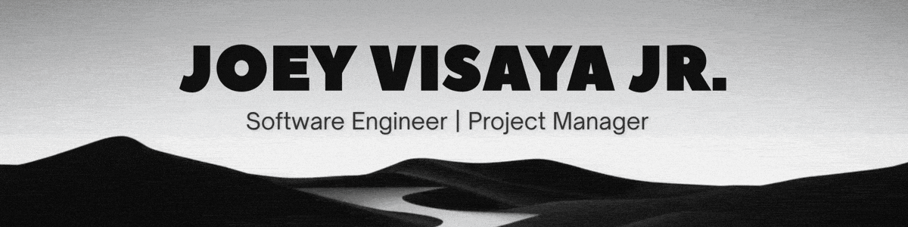
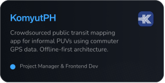
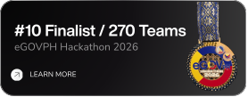
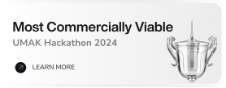

  <!-- Banner -->
  

    

  <!-- Typing Animation -->
  

    
  

   

  <!-- Social & Contact Buttons -->
  

    
    
    
    
    
  

<!-- About Me -->
<h3 align="left"> About Me</h3>

  CS student at <b>University of Makati</b> (Expected 2027), focused on <b>web and mobile development</b>.

  My current expertise lies in leading projects, requirement analysis, and frontend/UI-UX design and I'm currently adopting Matt Pocock's engineering skills for more structured AI-assisted development.

  I stay active across hackathons and student organizations to further expand my experience.

  

<!-- Languages & Frameworks -->
<h3 align="left">Languages &amp; Frameworks</h3>

  
  
  
  
  
  
  
  
  
  
  
  
  
  

<!-- Tools -->
<h3 align="left">Tools I Use</h3>

  

<!-- Projects -->
<h3 align="left">Projects I'm Currently Working On</h3>

  
  

<!-- Awards -->
<h3 align="left"> Awards I Won</h3>

  
  

<!-- Stats -->
<h3 align="left"> My Coding Activity &amp; Stats</h3>

  

  

