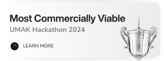
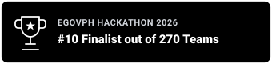

  <!-- Banner -->
  

  <!-- Typing Animation -->
  

    
  

  <!-- Social & Contact Buttons -->
  

    
    
    
    
    
  

 

<!-- About Me -->
<h3 align="left">About Me</h3>

<table border="0" style="border: none; border-collapse: collapse; width: 100%;">
  <tr style="border: none;">
    <td width="58%" style="border: none; vertical-align: top; padding-right: 15px;">
      

        CS student at <b>University of Makati</b> (Expected 2027), focused on <b>web and mobile development</b>.
      

      

        My current expertise lies in leading projects, requirement analysis, and frontend/UI-UX design and I'm currently adopting Matt Pocock's engineering skills for more structured AI-assisted development.
      

      

        I stay active across hackathons and student organizations to further expand my experience.
      

    </td>
    <td width="42%" style="border: none; vertical-align: middle;" align="center">
      
    </td>
  </tr>
</table>

 

  

<!-- Languages & Frameworks -->
<h3 align="left">Languages & Frameworks</h3>

  
  
  
  
  
  
  
  
  
  
  
  
  

  

<!-- Tools -->
<h3 align="left">Tools</h3>

  

  

<!-- Projects -->
<h3 align="left">Projects</h3>

  
  &nbsp;
  

  

<!-- Awards -->
<h3 align="left">Awards</h3>

  
  &nbsp;
  

  

<!-- Stats -->
<h3 align="left">Stats</h3>

  

